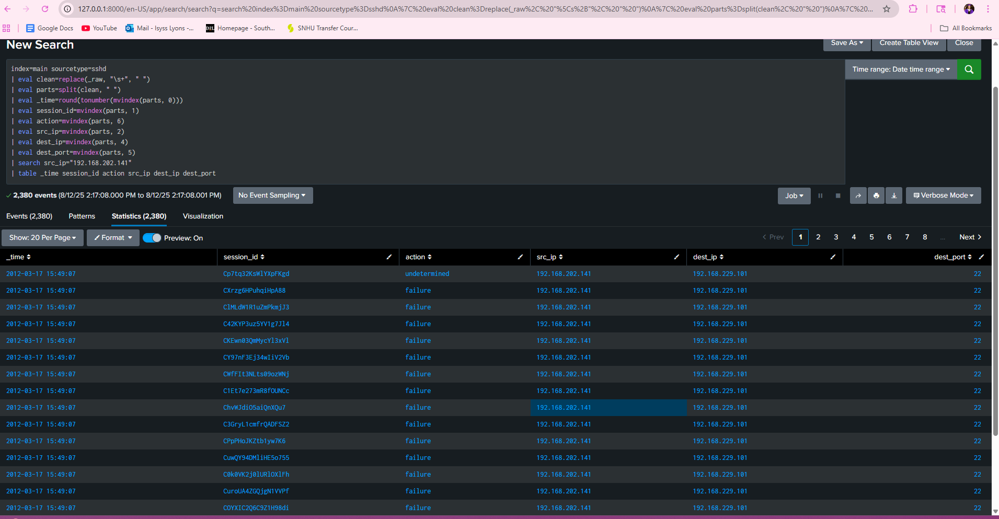

\# Splunk SSH Log Analysis Project


\## Introduction  

SSH (Secure Shell) logs provide detailed info about remote server access. This project demonstrates how to ingest and analyze SSH logs using Splunk SIEM to detect anomalies, failed login attempts, and suspicious IP activity.


---


\## Steps and Queries Used

```spl

1\. Search for SSH Events  


index=main sourcetype=sshd


2\. Extract Relevant Fields


index=main sourcetype=sshd

| eval parts=split(\_raw, "\\t")

| eval timestamp\_epoch=mvindex(parts, 0)

| eval session\_id=mvindex(parts, 1)

| eval src\_ip=mvindex(parts, 2)

| eval src\_port=mvindex(parts, 3)

| eval dest\_ip=mvindex(parts, 4)

| eval dest\_port=mvindex(parts, 5)

| eval action=mvindex(parts, 6)

| eval direction=mvindex(parts, 7)

| eval client\_version=mvindex(parts, 8)

| eval server\_version=mvindex(parts, 9)

| eval \_time=tonumber(timestamp\_epoch)

| eval \_time=strftime(\_time, "%Y-%m-%d %H:%M:%S")

| table \_time session\_id src\_ip src\_port dest\_ip dest\_port action direction client\_version server\_version


3\. Analyze SSH Activity Patterns


Count events by action (success, failure, undetermined):

index=main sourcetype=sshd

| eval clean=replace(\_raw, "\\s+", " ")

| eval parts=split(clean, " ")

| eval action=mvindex(parts, 6)

| stats count by action


Top 10 source IPs:

index=main sourcetype=sshd

| eval clean=replace(\_raw, "\\s+", " ")

| eval parts=split(clean, " ")

| eval src\_ip=mvindex(parts, 2)

| top limit=10 src\_ip


4\. Detect Anomalies


Look for unusual spikes in SSH activity over time:

index=main sourcetype=sshd

| eval clean=replace(\_raw, "\\s+", " ")

| eval \_time=round(tonumber(mvindex(split(clean, " "), 0)))

| timechart span=1h count


Analyze successful logins by source IP:

index=main sourcetype=sshd

| eval clean=replace(\_raw, "\\s+", " ")

| eval parts=split(clean, " ")

| eval action=lower(mvindex(parts, 6))

| eval src\_ip=mvindex(parts, 2)

| search action="success"

| stats count by src\_ip

| sort - count

(screenshots\\successful-logins-by-source-ip.png)


Analyze failed login attempts:

index=main sourcetype=sshd

| eval clean=replace(\_raw, "\\s+", " ")

| eval parts=split(clean, " ")

| eval action=lower(mvindex(parts, 6))

| eval src\_ip=mvindex(parts, 2)

| search action="failure"

| stats count by src\_ip

| sort - count


Investigate SSH sessions from a suspicious IP:

index=main sourcetype=sshd

| eval clean=replace(\_raw, "\\s+", " ")

| eval parts=split(clean, " ")

| eval \_time=round(tonumber(mvindex(parts, 0)))

| eval session\_id=mvindex(parts, 1)

| eval action=mvindex(parts, 6)

| eval src\_ip=mvindex(parts, 2)

| eval dest\_ip=mvindex(parts, 4)

| eval dest\_port=mvindex(parts, 5)

| search src\_ip="192.168.202.141"

| table \_time session\_id action src\_ip dest\_ip dest\_port


5\. Monitor User Behavior


Identify IPs with multiple failed login attempts:

index=main sourcetype=sshd

| eval clean=replace(\_raw, "\\s+", " ")

| eval parts=split(clean, " ")

| eval action=lower(mvindex(parts, 6))

| eval src\_ip=mvindex(parts, 2)

| search action="failure"

| stats count by src\_ip

| sort - count




Check failed login attempts over time for specific suspicious IPs:

index=main sourcetype=sshd

| eval clean=replace(\_raw, "\\s+", " ")

| eval parts=split(clean, " ")

| eval \_time=round(tonumber(mvindex(parts, 0)))

| eval session\_id=mvindex(parts, 1)

| eval action=mvindex(parts, 6)

| eval src\_ip=mvindex(parts, 2)

| eval dest\_ip=mvindex(parts, 4)

| eval dest\_port=mvindex(parts, 5)

| search src\_ip="192.168.202.141" OR src\_ip="192.168.202.110"

| table \_time session\_id action src\_ip dest\_ip dest\_port

| sort \_time


What I Did in This Project:


* Uploaded SSH log files to Splunk
* Parsed raw logs to extract key fields like timestamps, IPs, actions
* Built queries to analyze login success/failure, IP activity, and session info
* Detected anomalies such as spikes in failed login attempts
* Focused investigation on suspicious IP addresses
* Created dashboards to visualize data over time


What I Learned and Why It Matters:


* Raw logs need parsing for effective analysis in Splunk
* Failed login attempts are key indicators of potential attacks
* Visualizing event patterns helps detect unusual behavior early
* IPs can serve as user proxies when usernames are missing
* Dashboards enable continuous monitoring and quicker response


Why a Dashboard Helps


* Provides visual overview with charts and tables
* Highlights anomalies like sudden spikes in activity
* Interactive filtering for detailed investigation
* Saves time by automating common searches
* Facilitates reporting and sharing insights


Panels Created


* Total SSH events over time (line chart)
* Failed vs successful login attempts (bar or pie chart)
* Top source IPs by failed logins (table or bar chart)
* List of recent suspicious IP activities (table)
* Average session duration by IP (bar chart)


Resources and References


* Splunk Documentation
* Regex101
* Splunk Rex Command Guide
* Sample SSH logs: secrepo.com https://www.secrepo.com/maccdc2012/ssh.log.gz


